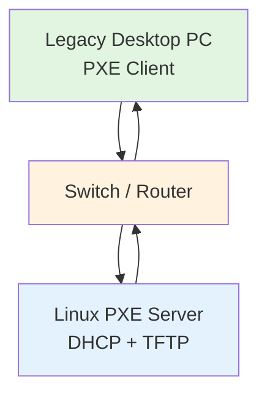
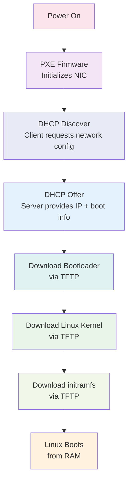

# PXE Network Boot Lab

## Overview

PXE (Preboot Execution Environment) is an industry standard protocol that allows computers to boot from the network instead of local storage devices like hard drives, USB drives, or DVDs. It enables diskless booting where the client machine downloads everything it needs to start—bootloader, kernel, and root filesystem—over the network.

PXE exists as a solution for centralized operating system deployment in enterprise environments. Instead of manually installing OS on each machine or managing physical media, administrators can deploy, maintain, and recover systems entirely over the network. This is especially valuable in large-scale environments like data centers, computer labs, and server farms where consistency and automation are critical.

The network boot process works as follows: When a PXE-enabled client powers on, its network interface card (NIC) firmware initiates a DHCP request to obtain an IP address and boot server information. The DHCP server responds with network configuration details and points to a TFTP server that hosts the boot files. The client then downloads the bootloader via TFTP, which in turn loads the Linux kernel and initramfs. Once these components are in memory, the kernel executes and boots the operating system entirely from RAM or network resources.

**Real-world use cases:**
- Enterprise OS deployment and imaging
- University computer labs and classroom environments
- Thin client and zero client deployments
- Server provisioning in data centers
- Automated OS installation and recovery
- Diskless workstations for security and centralized management

---

## Objectives

This lab demonstrates a complete PXE boot implementation with the following goals:

1. **Understand the PXE boot protocol** - Learn how network booting works at the firmware level and the sequence of network requests involved
2. **Implement DHCP and TFTP services** - Configure a Linux server to provide network configuration and file transfer services
3. **Deploy bootloader, kernel, and initramfs** - Set up the necessary components for a diskless boot environment
4. **Achieve successful network boot** - Boot a legacy PC entirely over the network without local storage
5. **Troubleshoot network boot issues** - Gain practical experience diagnosing common PXE boot failures

---

## Technologies Used

| Technology | Purpose |
|------------|---------|
| **PXE** | Network boot protocol that allows client machines to boot over Ethernet |
| **DHCP** | Dynamic Host Configuration Protocol - assigns IP addresses and provides boot server information to PXE clients |
| **TFTP** | Trivial File Transfer Protocol - lightweight protocol for transferring boot files (bootloader, kernel, initramfs) |
| **Linux** | Server operating system hosting the PXE services; client OS being booted |
| **Network Boot** | Method of starting a computer using network resources instead of local disks |
| **Ethernet** | Physical network medium connecting client to boot server |

---

## Hardware Used

- **Legacy Desktop PC** - PXE client machine (BIOS/UEFI with network boot capability)
- **Linux Server** - Dedicated machine running DHCP and TFTP services (can be physical or virtual)
- **Router / Switch** - Network infrastructure connecting client to server
- **Ethernet Cable** - Direct network connection between client and server/switch

---

## Network Topology



The network topology is straightforward: the PXE client and server are connected through a switch or router. The server runs both DHCP and TFTP daemons on the same machine. In a lab setting, this can be as simple as a direct Ethernet cable connection between two computers.

---

## PXE Boot Process

The PXE boot sequence follows a well-defined series of network transactions:



Let's break down each step:

1. **Power On** - The client machine powers up and the BIOS/UEFI takes control.

2. **PXE Firmware** - The network interface card's PXE firmware initializes the Ethernet adapter and becomes active. It searches for a boot server on the network.

3. **DHCP Discover** - The client broadcasts a DHCPDISCOVER message on the network, requesting network configuration and PXE boot options.

4. **DHCP Offer** - The DHCP server responds with a DHCPOFFER containing:
   - IP address for the client
   - Subnet mask, gateway, DNS servers
   - TFTP server address
   - Bootloader filename (typically `pxelinux.0` or similar)

5. **Download Bootloader** - The client uses TFTP to download the PXE bootloader from the server. This is usually `pxelinux.0` (from SYSLINUX project) or `grubx64.efi` for UEFI systems.

6. **Download Linux Kernel** - Once the bootloader runs, it fetches the Linux kernel image (`vmlinuz` or similar) via TFTP.

7. **Download initramfs** - The initial RAM filesystem (initramfs) containing essential drivers and tools is also downloaded via TFTP. This provides the kernel with minimal filesystem access to mount the real root.

8. **Linux Boots** - The kernel executes, initramfs mounts (either to real storage or continues in RAM), and the system boots into a functional Linux environment—all without touching local disks.

---

## What I Learned

### DHCP (Dynamic Host Configuration Protocol)

DHCP is fundamental to PXE booting. It's not just about IP address assignment—in the PXE context, DHCP provides critical boot parameters through **options**:

- **Option 66 (TFTP Server Name)** - specifies the hostname or IP of the TFTP server
- **Option 67 (Bootfile Name)** - tells the client which bootloader file to download
- **Option 43 (Vendor-Specific Info)** - sometimes used for vendor-specific boot configurations

Understanding DHCP lease times, scope configuration, and option propagation was key to getting PXE working reliably.

### TFTP (Trivial File Transfer Protocol)

TFTP is intentionally simple—it uses UDP (port 69) and has no authentication or advanced features. For PXE, this simplicity is actually beneficial because the client firmware has minimal code. However, TFTP's lack of security and built-in directory listing means we must carefully manage file permissions and paths on the server. The TFTP root directory typically lives at `/srv/tftp` and must be world-readable.

### UDP Communication

Both DHCP and TFTP operate over UDP rather than TCP. UDP is connectionless and doesn't guarantee delivery, but it's faster and simpler—perfect for the early boot environment where the client has minimal networking stack. PXE relies on retransmission logic built into the client firmware to handle lost packets. Large files like kernels are transferred in 512-byte blocks with acknowledgment packets.

### PXE Boot Process

The most valuable insight was understanding **who does what** during boot:

- **Firmware** decides whether to do legacy BIOS PXE or UEFI network boot
- **DHCP server** provides network config and boot directives
- **TFTP server** simply serves raw files
- **Bootloader** (pxelinux/grub) interprets config files and loads kernel+initramfs
- **Kernel** takes over once loaded into memory

### Bootloaders (SYSLINUX/GRUB)

I used **SYSLINUX** with PXELINUX for BIOS-based PXE boot. The bootloader provides a menu system, config file parsing, and kernel loading capabilities. The configuration file (`default` or `pxelinux.cfg/default`) lives on the TFTP server and controls boot options. For UEFI systems, **GRUB2** with `grubx64.efi` is needed instead.

### Linux Networking

Configuring the server required understanding Linux networking: static IP assignment, firewall rules (allowing UDP 67, 68, 69), SELinux/AppArmor considerations for TFTP, and proper directory structure. I learned to check bind mounts, file ownership, and network interface configuration to ensure clients can reach the server.

### Diskless Computing

Booting without local storage means the root filesystem must come from somewhere:
- **initramfs only** - full system runs from RAM (limited space, good for thin clients)
- **NFS root** - mount root filesystem over the network from an NFS server
- **iSCSI root** - boot from block storage over the network
- **HTTP/FTP root** - alternative network filesystems

This architecture enables centralized management, improved security (no local data), and simplified maintenance—all at the cost of network dependency.

---

## Challenges Faced

### DHCP Misconfiguration

**Problem:** The PXE client received an IP address but no bootfile information, causing it to hang after DHCP handshake.

**Cause:** Missing or incorrectly configured DHCP options 66 and 67 in `dhcpd.conf`.

**Solution:** Added the following to the subnet declaration:
```conf
option tftp-server-name "192.168.1.10";
filename "pxelinux.0";
```
Restarted `dhcpd` and verified with `tcpdump` that options were being sent.

---

### TFTP File Path Issues

**Problem:** Bootloader downloaded successfully, but kernel failed with "File not found" error.

**Cause:** TFTP server's root directory structure didn't match the paths referenced in `pxelinux.cfg/default`. The kernel filename had a typo, and file permissions were too restrictive.

**Solution:** Ensured consistent naming and set proper permissions:
```bash
chmod 644 /srv/tftp/linux/vmlinuz
chmod 644 /srv/tftp/linux/initrd.img
```
Verified TFTP root was correctly set in `tftpd-hpa` config and file paths were relative to that root.

---

### PXE Boot Failures

**Problem:** Client would display "No boot file received" or simply hang after PXE initialization.

**Cause:** Multiple potential causes—firewall blocking UDP ports, wrong bootloader filename, or network connectivity issues.

**Solution:** Systematically eliminated possibilities:
1. Disabled local firewall temporarily (or allowed UDP 67, 68, 69)
2. Confirmed client and server on same subnet
3. Verified `pxelinux.0` existed and was executable
4. Used `tcpdump -i eth0 port 69 or port 67 or port 68` to monitor PXE traffic

---

### BIOS Boot Order

**Problem:** Client ignored PXE and booted directly from hard drive.

**Cause:** Network boot wasn't prioritized in BIOS settings, or hard drive was first in boot order.

**Solution:** Entered BIOS setup (typically F2, F10, F12, or Del during POST) and:
- Enabled network/PXE boot
- Moved "Network" or "Onboard NIC" to top of boot priority list
- Disabled fast boot if present (can skip PXE check)

---

### Legacy BIOS vs UEFI

**Problem:** Modern client machine refused to PXE boot with `pxelinux.0` (BIOS bootloader).

**Cause:** Client was UEFI-only and requires `grubx64.efi` bootloader, not legacy BIOS PXE.

**Solution:** Identified firmware type (check BIOS settings or look for "UEFI" boot options). For UEFI PXE:
- Use `grubx64.efi` (or `shim.efi` for Secure Boot)
- Place files in `srv/tftp/grub2/` structure
- Configure DHCP with `filename "grubx64.efi";`
Note: Mixing BIOS and UEFI clients requires a hybrid setup with different boot paths.

---

## Skills Demonstrated

| Skill | Proficiency | Evidence |
|-------|-------------|----------|
| **Networking** | Intermediate | Configured DHCP scopes, understood UDP/IP, subnet planning |
| **Linux Administration** | Intermediate | Set up and managed `dhcpd`, `tftpd-hpa`, file permissions, SELinux |
| **DHCP Configuration** | Proficient | Configured options 66/67, scopes, reservations, tested with `dhcping` |
| **TFTP Setup** | Proficient | Installed, configured, secured TFTP root directory, validated file transfers |
| **PXE Implementation** | Competent | End-to-end setup of network boot environment from server to client |
| **Bootloader Management** | Competent | Deployed and configured PXELINUX/GRUB, wrote boot menus |
| **Troubleshooting** | Strong | Used `tcpdump`, `journalctl`, log files to diagnose boot failures |
| **System Configuration** | Intermediate | Edited config files, managed services with systemd, set up directory structure |
| **Documentation** | Strong | Created clear lab notes, diagrams, and step-by-step procedures |

---

## Future Improvements

While this lab demonstrates basic PXE boot, several enhancements could make the system more robust and feature-rich:

**iPXE Integration**
- Replace or supplement PXELINUX with iPXE, a more powerful open-source boot firmware
- Benefits: HTTP boot support, scripting, SAN boot, chainloading, better UEFI support
- Enables booting from HTTP servers instead of TFTP, simplifying firewall rules

**HTTP Boot**
- Use HTTP instead of TFTP for file transfers—more reliable, supports larger files, easier to debug
- Modern UEFI firmware often includes native HTTP boot support
- Could use Nginx or Apache instead of TFTP daemon

**Automated OS Deployment**
- Integrate with Cobbler or Foreman for automated OS installation
- Kickstart (Red Hat/Fedora) or preseed (Debian/Ubuntu) files for unattended installs
- Post-install configuration management with Ansible/Puppet

**Multi-OS Support**
- Configure PXE menu to boot multiple distributions (Ubuntu, CentOS, FreeBSD, etc.)
- Different kernel + initramfs combinations
- Live ISO boot via PXE (memdisk or HTTP)

**Secure Boot Compatibility**
- Implement UEFI Secure Boot chain with signed bootloaders and kernels
- Use shim.efi to bootstrap into GRUB with Microsoft key enrollment
- Sign kernel modules and initramfs to meet enterprise security requirements

**NFS Root Filesystem**
- Mount root over NFS for persistent storage instead of RAM-only
- Share a single root FS among many clients (read-only) with overlayfs for /home, /var
- Better for diskless workstations that need persistent configuration

**Centralized Logging**
- Configure clients to send boot logs to a central server
- Use `syslog-ng` or `rsyslog` over network for troubleshooting

**Failover / High Availability**
- Run multiple DHCP/TFTP servers
- Use `dhcp-failover` protocol for DHCP redundancy
- Sync TFTP roots between servers for load balancing

---

## Project Gallery

*Screenshots and visual documentation will be added here once available.*

### Network Topology Screenshot
_Placeholder: Screenshot of actual network setup showing client, switch, and server connections_

### PXE Boot Screen
_Placeholder: Photo of client display showing PXE boot menu from SYSLINUX/GRUB_

### Linux Boot Process
_Placeholder: Screenshot capturing kernel boot messages during network boot_

### Final Running System
_Placeholder: Terminal showing successfully booted system with `uname -a` and network info_
